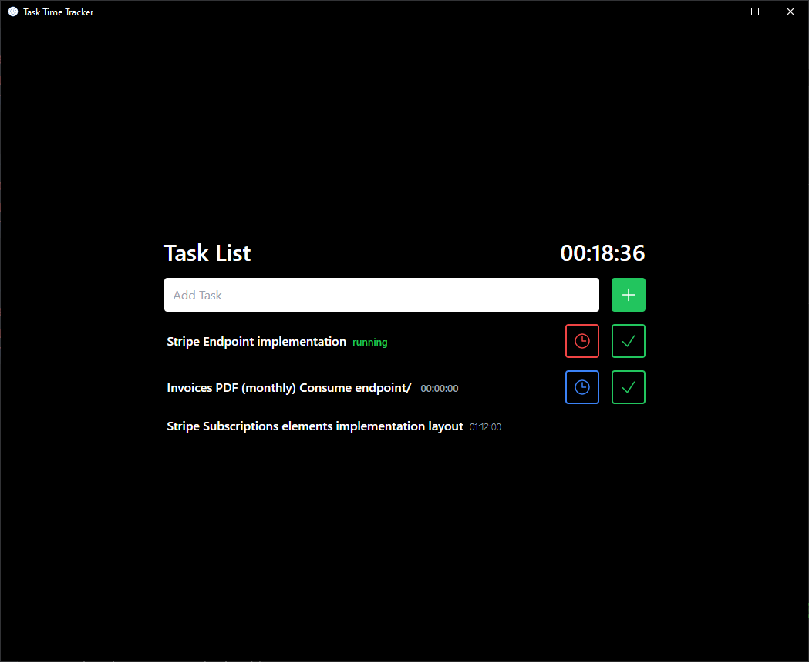
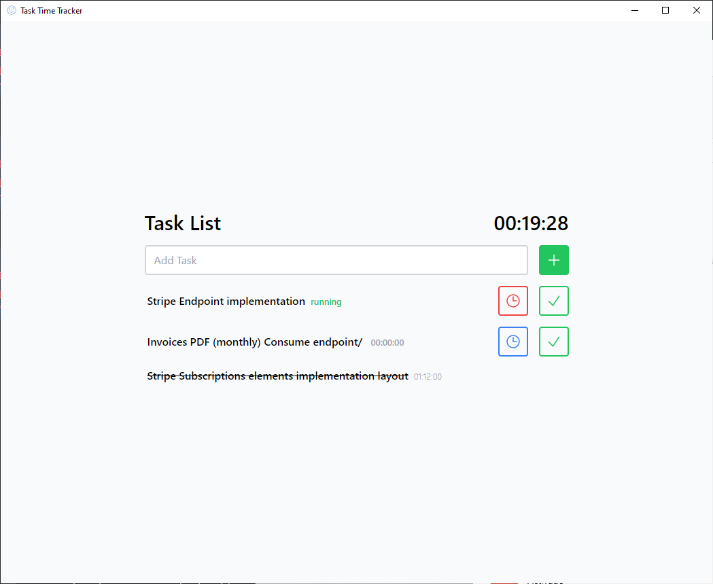

# Task Time Tracker

Keep track of the time you spend solving your tasks.

## Features

* Add and complete tasks.
* Start or pause the time tracker
* Automatic dark or light mode depending on the configuration of your operating system.

<div style="display:flex; flex-wrap: wrap;">
    
    
</div>

## Technologies

* Electron
* Nextjs
* Tailwindcss
* Typescript
* Yarn

## Usage

### Install Dependencies

```
$ cd my-app

# using yarn or npm
$ yarn (or `npm install`)

# using pnpm
$ pnpm install --shamefully-hoist
```

### Use it

```
# development mode
$ yarn dev (or `npm run dev` or `pnpm run dev`)

# production build
$ yarn build (or `npm run build` or `pnpm run build`)
```
